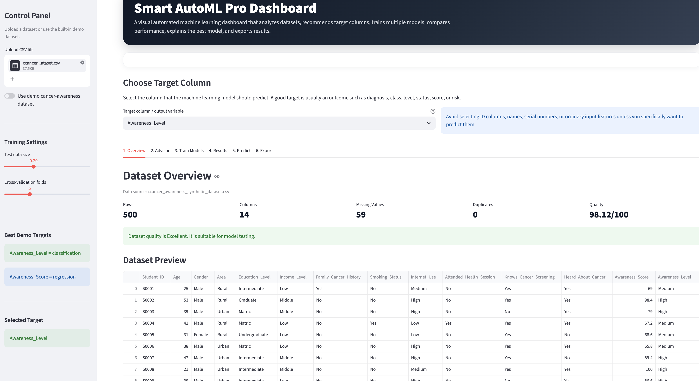
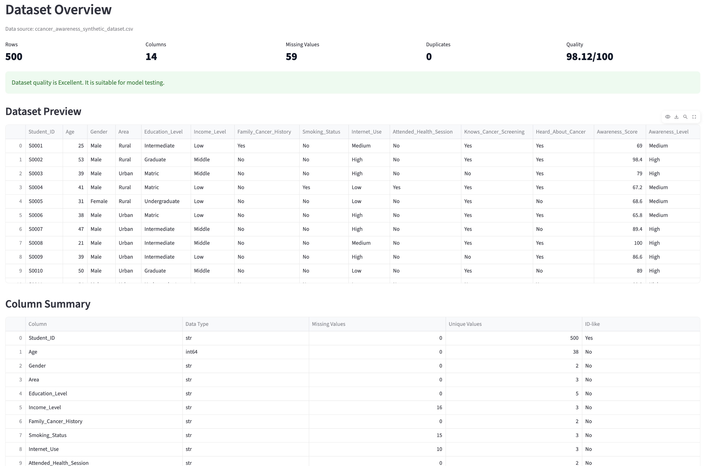
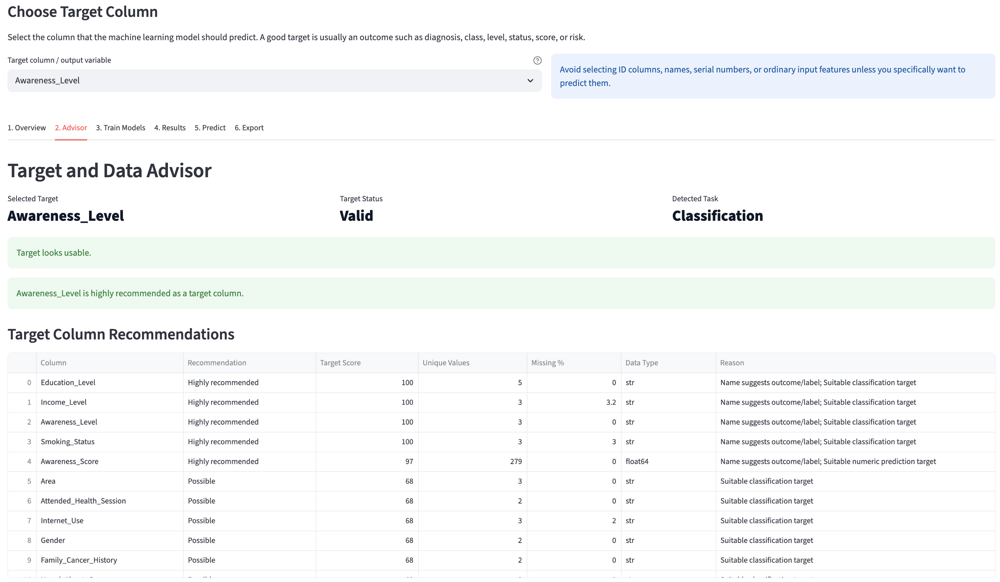
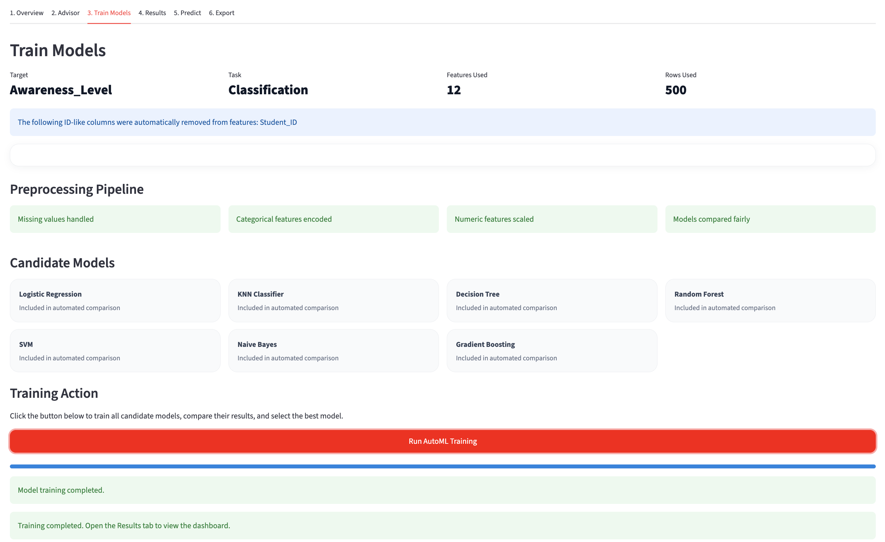
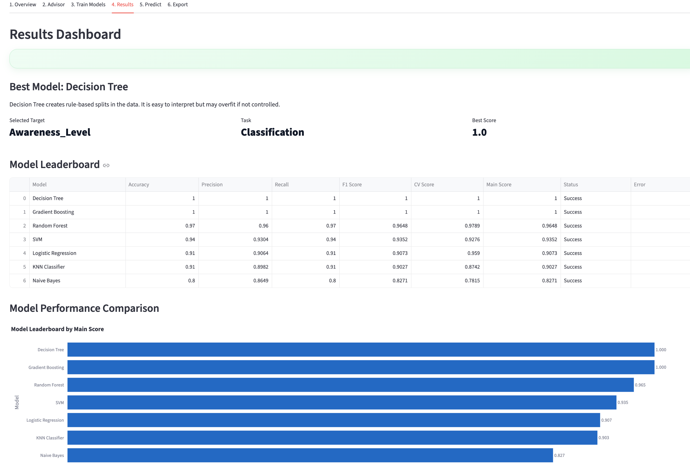
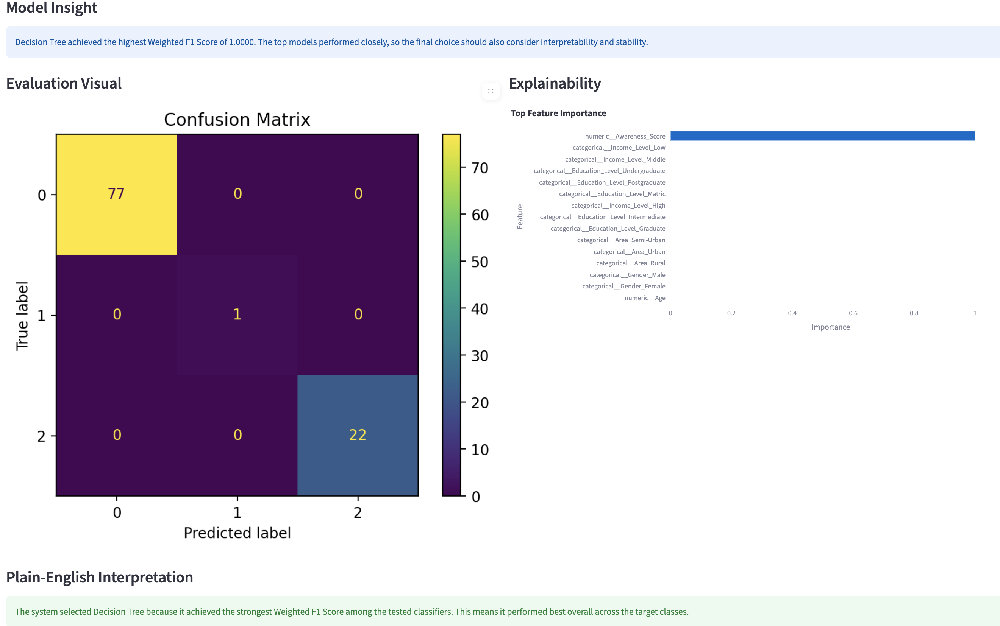
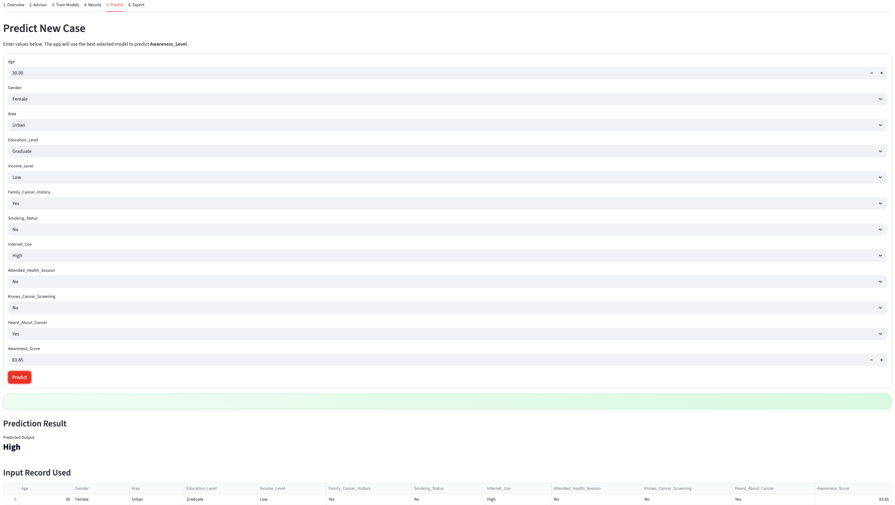

# Smart AutoML Pro Dashboard

An interpretable visual AutoML system that automatically selects, trains, evaluates, and recommends the best machine learning model for tabular datasets.

---

## Overview

This project simplifies the end-to-end machine learning workflow by eliminating manual trial-and-error in model selection. The system analyzes the dataset, identifies the most suitable target variable, detects whether the problem is classification or regression, trains multiple models, compares their performance, and provides predictions through an interactive dashboard.

---

## Key Features

* Automatic target column recommendation
* Classification vs regression detection
* Data quality analysis and cleaning advisor
* Automated preprocessing (missing values, encoding, scaling)
* Multi-model training (SVM, Random Forest, KNN, etc.)
* Model leaderboard with performance comparison
* Confusion matrix and evaluation metrics
* Prediction module for new cases
* Export-ready outputs and reports

---

## System Workflow

Dataset → Analysis → Target Selection → Preprocessing → Model Training → Evaluation → Best Model Selection → Prediction → Export

---

## Screenshots

### Dashboard Overview



### Data Insights / Overview



### Target Advisor



### Training Module



### Model Leaderboard



### Confusion Matrix



### Prediction Result



---

## How to Run

```bash
pip install -r requirements.txt
streamlit run app.py
```

---

## Project Structure

```
smart-automl-pro-dashboard/
├── app.py
├── requirements.txt
├── README.md
├── dataset/
│   └── sample_dataset.csv
├── screenshots/
│   ├── dashboard_home.png
│   ├── overview_tab.png
│   ├── target_advisor.png
│   ├── training_module.png
│   ├── model_leaderboard.png
│   ├── confusion_matrix.png
│   └── prediction_result.png
└── report/
    └── Smart_AutoML_Pro_Dashboard_Report.pdf
```

---

## Research Paper

The complete research paper is available here:

📄 [Download Report](report/Smart_AutoML_Pro_Dashboard_Report.pdf)

---

## Tech Stack

* Python
* Streamlit
* Scikit-learn
* Pandas, NumPy
* Plotly, Matplotlib

---

## Use Case

This system is designed for:

* Students learning machine learning
* Beginners struggling with model selection
* Rapid prototyping of ML solutions
* Educational demonstrations of ML workflows

---

## Author

Hassnain Khan
Computer Engineering Student

---

## License

This project is licensed under the MIT License.
